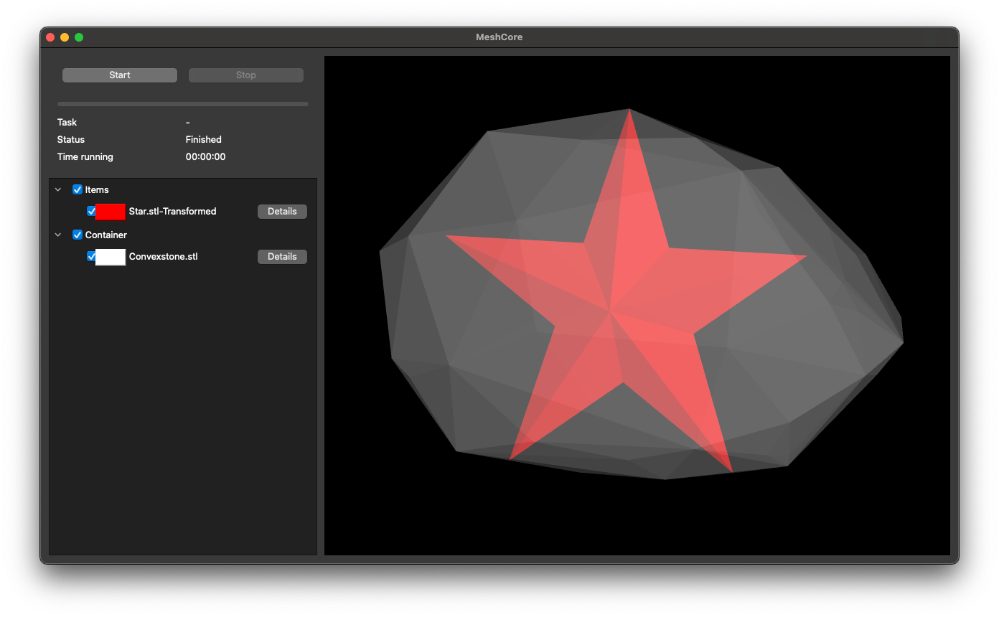

# Quadratically constrained models for single volume maximisation problems

## General information

`svmp-quaternion-qcp` constructs and solves exact models of 3D single volume maximisation problems.
It uses the [MeshCore library](https://github.com/JonasTollenaere/MeshCore) for loading files, rendering and providing the necessary geometric operations required to construct the MILP models.

The project use uses CMake as its build system.
We recommend using vcpkg as a package manager to install the dependencies that are defined in the `vcpkg.json` file.
To set up a development environment, we refer to the [vcpkg documentation](https://vcpkg.io/en/getting-started).

The MILP models are solved using Gurobi.
CMake is not able to find the Gurobi installation automatically on every platform when using the vcpkg toolchain, so we configured the project to use the paths to the Gurobi installation as CMake variables.
See more in [CMakeLists.txt](CMakeLists.txt).

## CMake targets

- `ConvexQuaternionQCP` and `ConvexQuaternionQCPInverse`:\
Run a QCP model for a single problem instance in a convex container.
- `ConvexQuaternionQCPBenchmark` and `ConvexQuaternionQCPInverseBenchmark`:\
Run the models on a complete benchmark suite of single volume maximisation instances.
- `ConcaveQuaternionQCP`:\
Run a QCP model for a single problem instance in a concave container
- `ConcaveQuaternionQCPBenchmark`:\
Run the model on a complete benchmark suite of single volume maximisation instances.
- `VisualizeConcavities`:\
Visualizes the concavities of a concave container
- `VisualizeSymmetry`:\
Visualization of symmetry breaking planes